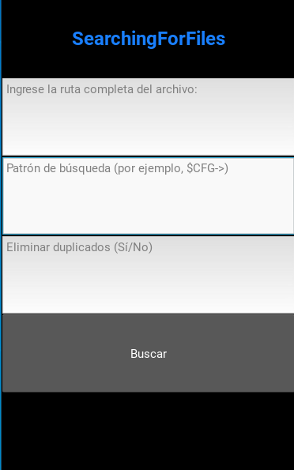

# SearchingForFiles 🔍

<p align="center">
  
</p>

# implementa cosas 🚀



# visualiza el proceso ::thread::


# vista del documento ::monocle_face::


SearchingForFiles es una herramienta de búsqueda de patrones en archivos que le permite encontrar y recopilar información útil de manera eficiente. Busque patrones en archivos dentro de una carpeta y guarde los resultados en un archivo CSV con facilidad.

## Características

* **🔍 Búsqueda de patrones en archivos**
* **📁 Guardado de resultados en un archivo CSV**
* **✅ Opción para eliminar duplicados**
* **🖥️ Interfaz gráfica sencilla e intuitiva**

## Cómo usar

1. Instale las dependencias:

   ```bash
   python -m venv venv
   venv\Scripts\activate  # Para Windows
   pip install pyttsx3 pandas kivy
   ```

# Ejecute el programa:

bash

1. Copy code
   python searchingforfiles.py
   Ingrese la ruta de la carpeta que desea buscar:
2. makefile

C:\Users\JuanPablo\Documents
Ingrese el patrón de búsqueda:

3. bash

$CFG->
(Opcional) Seleccione si desea eliminar duplicados:

4. Sí
   Haga clic en "Buscar". ✅

Los resultados se guardarán en un archivo CSV llamado variables.csv en el directorio actual.

# Contribuidores:

<p align="center">
  
  <br>
  <strong>Juan Pablo</strong>
  <br>
  <a href="mailto:JUANPABLO2007k@gmail.com">JUANPABLO2007k@gmail.com</a>
</p>

<p align="center">
  
  <br>
  <strong>Contribuidor 2</strong>
  <br>
  <a href="mailto:juan.velasquez@openlms.net">juan.velasquez@openlms.net</a>
</p>

## Licencia

SearchingForFiles está bajo la Licencia MIT. Consulte el archivo LICENSE.md para obtener más detalles. 📄

# Autor:technologist::

Juan Pablo Castillo velasquez


GitHub 🌐  [Mi perfil en github](https://github.com/JuanPablo-Openlms)

## Tecnologías Usadas

<p align="center">
  
  

</p>

# Notas adicionales:

Asegúrese de que las bibliotecas requeridas estén instaladas antes de ejecutar el programa.
Este programa utiliza la biblioteca Kivy para su interfaz gráfica, por lo que la apariencia puede variar según la plataforma.
Los resultados se guardan en un archivo CSV llamado variables.csv.
Mejoras

[](./project0.1.py)
[](./img)
