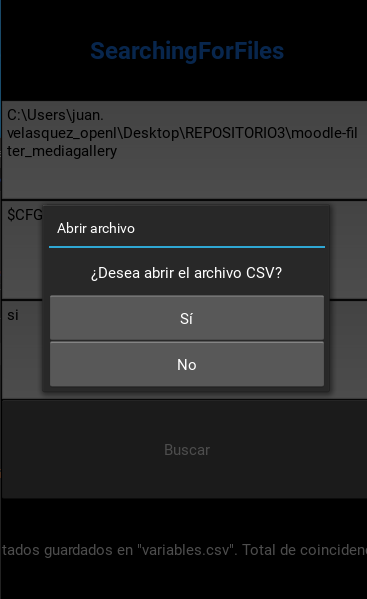
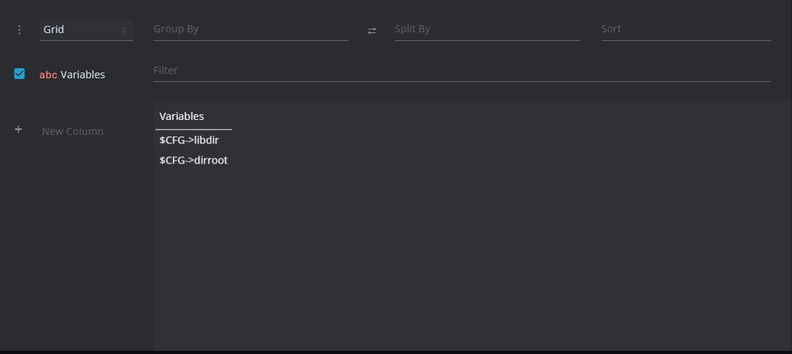

# SearchingForFiles 🔍

<p align="center">
  <strong>¡Bienvenido a SearchingForFiles!</strong><br>
  
</p>


## Tabla de Contenidos
<table align="center">
  <tr>
    <th><a href="#instalacion-mag_right">:mag_right: Instalación</a></th>
    <th><a href="#bibliotecas-book">:gear: Bibliotecas</a></th>
    <th><a href="#configuraciongear">:computer: Configuración</a></th>
    <th><a href="#uso-computer">:computer: Uso</a></th>
    <th><a href="#contribuidores-busts_in_silhouette">:busts_in_silhouette: Contribuidores</a></th>
    <th><a href="#licencia-page_with_curl">:page_with_curl: Licencia</a></th>
    <th><a href="#autortechnologist">:man_technologist: Autor</a></th>
  </tr>
</table>

# Introducción

SearchingForFiles es una herramienta de búsqueda de patrones en archivos que le permite encontrar y recopilar información útil de manera eficiente. Busque patrones en archivos dentro de una carpeta y guarde los resultados en un archivo CSV con facilidad.

## Características

* **🔍 Búsqueda de patrones en archivos**
* **📁 Guardado de resultados en un archivo CSV**
* **✅ Opción para eliminar duplicados**
* **🖥️ Interfaz gráfica sencilla e intuitiva**

# Instrucciones para Instalar Python y Configurar las Variables de Entorno en Windows

Antes de comenzar con el desarrollo en Python, asegúrate de seguir estos pasos para instalar Python y configurar las variables de entorno en tu sistema Windows.

## instalacion :mag_right:

1. Accede al sitio web oficial de Python en [python.org/downloads](https://www.python.org/downloads/).
2. Descarga la última versión estable de Python para Windows haciendo clic en el botón de descarga. 📥
3. Ejecuta el instalador descargado. 🏁
4. Asegúrate de marcar la casilla "Add Python X.X to PATH" (donde X.X es la versión de Python que estás instalando). Esto es crucial para configurar las variables de entorno correctamente. ✔️
5. Continúa con la instalación siguiendo las instrucciones en pantalla. 🚀
6. Una vez finalizada la instalación, abre una ventana de comandos (CMD) o PowerShell para verificar que Python se ha instalado correctamente. Ejecuta el siguiente comando:

   ```
   python --version
   ```

## Bibliotecas :book:


Para utilizar esta herramienta, siga estos pasos:

1. Cree un entorno virtual (venv) para aislar las dependencias del proyecto:

   ```bash
   python -m venv venv
   ```

##### Active el entorno virtual:  :electric_plug:**

## Windows:

```bash
venv\Scripts\activate

```
## linux o Linux/macOS 
```bash
source venv/bin/activate
```

# librerias 

```bash
pip install pyttsx3 pandas kivy
```

## Configuracion:gear:

Antes de comenzar, asegúrese de haber configurado correctamente el entorno virtual y las bibliotecas necesarias. Si ha seguido los pasos de instalación, su entorno estará listo para usar.

# uso :computer:

Una vez que hayas instalado Python, puedes ejecutar el programa proporcionando la ruta completa de la carpeta que deseas buscar.

1. **Supongamos que deseas buscar en la carpeta**
```
C:\Users\JuanPablo\Documents.
```

2. **Ingrese el patrón de búsqueda en el cuadro de texto correspondiente, por ejemplo:** 

```php
$CFG->.
```

3. **(Opcional) Seleccione si desea eliminar duplicados.**
<p align="center">
  
</p>

Haga clic en el botón "Buscar". :white_check_mark:

Los resultados se guardarán en un archivo CSV llamado variables.csv en el directorio actual.
<p align="center">
  
</p>

## Contribuidores :busts_in_silhouette:
Este proyecto ha sido posible gracias a las contribuciones de:

<p align="center">
  
  <br>
  <strong>Juan Pablo</strong>
  <br>
  <a href="mailto:JUANPABLO2007k@gmail.com">JUANPABLO2007k@gmail.com</a>
</p>
<p align="center">
  
  <br>
  <strong>Contribuidor 2</strong>
  <br>
  <a href="mailto:juan.velasquez@openlms.net">juan.velasquez@openlms.net</a>
</p>

## Licencia :page_with_curl:
SearchingForFiles está bajo la Licencia MIT. Consulta el archivo LICENSE.md para obtener más detalles. 

## Autor:technologist::
Juan Pablo Castillo Velasquez


GitHub [GitHub 🌐 Mi perfil en github](https://github.com/JuanPablo-Openlms)


## Notas Adicionales :page_with_curl:
Asegúrese de que las bibliotecas requeridas estén instaladas antes de ejecutar el programa.

Este programa utiliza la biblioteca Kivy para su interfaz gráfica, por lo que la apariencia puede variar según la plataforma.

Los resultados se guardan en un archivo CSV llamado variables.csv.
